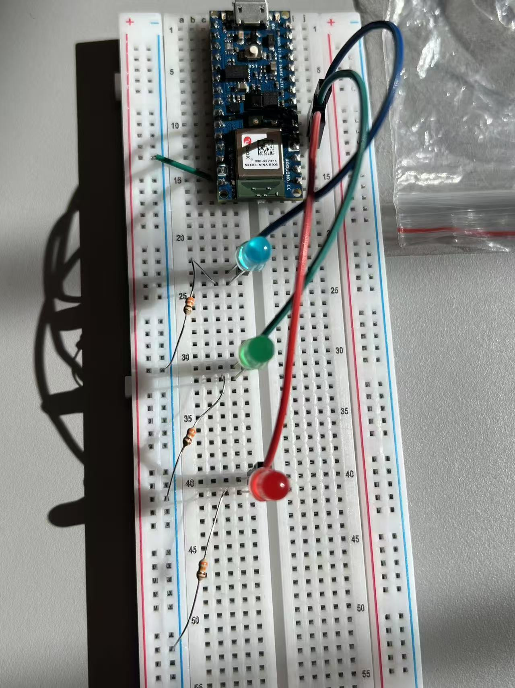
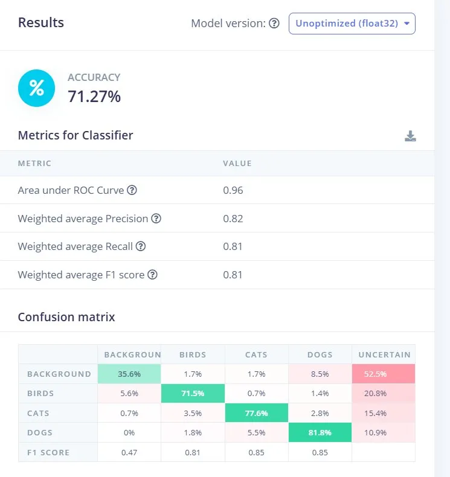
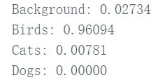
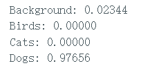
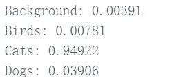

# CASA0018: Animal Sound Classifier

A real-time animal sound classification system deployed on an Arduino Nano 33 BLE Sense. The device uses its onboard PDM microphone to classify incoming audio into four categories — dog, cat, bird, and background noise — and communicates results through three external LEDs.

## Project Overview

- **Platform:** Arduino Nano 33 BLE Sense
- **Model:** 1D CNN trained via Edge Impulse
- **Classes:** Dog, Cat, Bird, Background
- **Inference time:** 3 ms
- **Peak RAM:** 12.6 KB
- **Validation accuracy:** 86.3%

## Repository Structure

- `code/` — Arduino inference and LED control code
- `data/` — Python script for bird audio trimming
- `results/` — Confusion matrices, serial output examples and wiring photo

## Dataset

| Class | Source | Size |
|-------|--------|------|
| Dog | [Kaggle](https://www.kaggle.com/) | ~500 WAV files |
| Cat | [Kaggle](https://www.kaggle.com/) | ~500 WAV files |
| Bird | [BirdCLEF 2022](https://www.kaggle.com/c/birdclef-2022) | 80 files (trimmed) |
| Background | Self-recorded | ~5 minutes |

Bird recordings were trimmed to the 5-second segment of highest amplitude using `data/trim_birds.py` to address class imbalance.

## Hardware

- Arduino Nano 33 BLE Sense
- 3x LEDs (Red, Green, Blue)
- 3x 330Ω resistors
- Breadboard + jumper wires

## Wiring

| Pin | LED | Class |
|-----|-----|-------|
| D2 | Red | Bird |
| D3 | Green | Cat |
| D4 | Blue | Dog |

All LED cathodes connect via 330Ω resistors to GND.

## Model Training

Training was conducted in [Edge Impulse](https://edgeimpulse.com). Four iterations were run:

| Version | LR | Epochs | Augmentation | Val Accuracy |
|---------|----|--------|-------------|--------------|
| v1 | 0.005 | 100 | Default | 83.9% |
| v2 | 0.005 | 150 | +Freq mask | 83.9% |
| v3 | 0.001 | 100 | Default | 85.8% |
| v4 | 0.001 | 200 | +Time mask High | 86.3% |

| Validation Set | Test Set |
|---|---|
|  |  |

## Serial Output Examples

| Bird | Dog | Cat |
|---|---|---|
|  |  |  |

## Usage

1. Install the Arduino library exported from Edge Impulse via **Sketch → Include Library → Add .ZIP Library**
2. Open `code/animal_sound_classifier.ino` in Arduino IDE
3. Select board: **Arduino Nano 33 BLE**
4. Upload to device
5. Play animal sounds near the microphone — LEDs will activate when confidence exceeds 0.90

## Demo Video

[demo.mp4](video/CASA0018.mp4)

## Edge Impulse Project

[CASA0018-HCS on Edge Impulse](https://studio.edgeimpulse.com/studio/939419)
